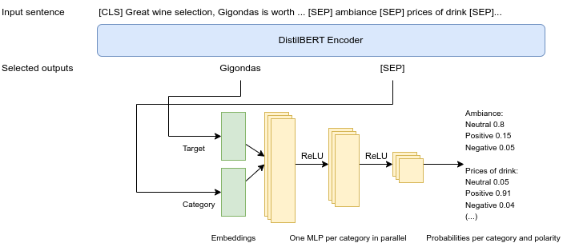

# NLP Assignment: Aspect-Term Polarity Classification in Sentiment Analysis

## Students

- Alexandre Maranhão
- Artur Gallois

## Description



We used DistilBERT [1] as our base model. The choice of a BERT derived model is motivated by the fact that they are open-source, pre-trained in a large corpus, and have a reasonable size. In particular, DistilBERT is a smaller, lighter version of BERT trained by distillation of the original model, that is, trained to predict the same probabilities and similar hidden states. As we don't have access to a lot of training data, a smaller model is less prone to overfitting.

We pass as input to DistilBERT the original sentence from the dataset, followed by the following string:

```
ambiance[SEP]prices of drink[SEP]quality of drink[SEP]style options of drink[SEP]price of food[SEP]quality of food[SEP]style options of food[SEP]location of[SEP]restaurant[SEP]restaurant[SEP]price of restaurante[SEP]service
```

It represents each of the 12 categories separated by `[SEP]` tokens. For example, consider the following row from the dev set:

- Sentence: Great wine selection, Gigondas is worth the price, and the house champagne is a great value.
- Category: DRINKS#PRICES
- Target: Gigondas
- Offset: 22:30

The input to the model will be the tokenized version of

```
[CLS] Great wine selection, Gigondas is worth the price, and the house champagne is a great value. [SEP] ambiance[SEP]prices of drink[SEP]quality of drink[SEP]style options of drink[SEP]price of food[SEP]quality of food[SEP]style options of food[SEP]location of[SEP]restaurant[SEP]restaurant[SEP]price of restaurante[SEP]service
```

where `[CLS]` is the classification token that marks the beggining of the input and `[SEP]` is the separator between two sentences. This approach is motivated by the encoder part of paper [2].

The DistilBERT model outputs one 786 vector per token, providing a word-level understanding. We concatenate the following two vectors: 

1. The representation of the `[SEP]` token that comes just before the category of interest
2. The representation of the target token.

In the previous example, the dataset tells that the target begins at character 22. We can use the `char_to_token` HuggingFace function to map this to a token index, for example to token number 6. So we take from the DistilBERT output the vectors associated to token number 6 and to the second `[SEP]`, that comes just before "prices of drink", and we concatenate them. Note that this approach also allows to disambiguate a same target that appears twice in a sentence, possibly in different contexts, since we use the DistilBERT output for the desired position.

The concatenated vector is then passed through a category-specific MLP $f_{category}$ with two hidden layers and an output layer. We used layers with sizes 256, 32, 3, and ReLU activations. Note that we have 12 different MLPs, with different parameters, one for each category, that act in parallel, without any shared parameter or influence in one another.

In addition to the described layers, we used Dropout layers with probability 0.2 in order to avoid overfitting. They are placed after the DistilBERT and after each ReLU in the MLPs. We omitted from the representation for the sake of clarity.

The whole model, including the pre-trained weights, is optimized with AdamW. Weight decay is a term in optimizer algorithms such as SGD and Adam that exponentially decreases the weights in order to regularize them - in the case of SGD, it is equivalent to L2 regularization. AdamW [3] is a version of Adam that decouples weight decay from the optimization steps with respect to the loss function, and ultimately improves Adam's ability to generalize. The authors suggest using as weight decay a hyperparameter called normalized weight decay multiplied by the square root of the ratio between the batch size b and the product between number of training samples B and number of epochs T ([3], Appendix B.1), that is,
$$ \lambda = \lambda_{norm} \sqrt{\frac{b}{BT}}$$

We ran training for 15 epochs with AdamW. The optimization process uses learning rate 5e-5, batch size 64, and normalized weight decay 0.048. In addition, we use the dev f1 score to select the best model seen during training, in order to avoid overfitting to the training set.

## Results

On the dev set, we got an average accuracy of 85.64% over 5 runs.

## References 

- [1] V. Sanh et al., DistilBERT, a distilled version of BERT: smaller, faster, cheaper and lighter (2019), arXiv:1910.01108
- [2] Z. Dai et al., A Multi-Task Incremental Learning Framework with Category Name Embedding for Aspect-Category Sentiment Analysis (2020), arXiv:2010.02784
- [3] Loshchilov,I., Hutter, F., Decoupled Weight Decay Regularization (2019), arXiv:1711.05101